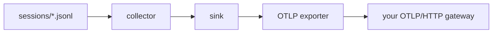

# Architecture

`telemetron` is a small pipeline: tail local session files, derive bounded counters, and export them to an OTLP/HTTP endpoint.

## Flow

```text
sessions/*.jsonl
       |
       v
     tail
       |
       v
derive counters
       |
       v
   OTLP/HTTP
       |
       v
 your gateway
```



## Three-layer separation

- Collector: mode-specific logic that reads local agent state and emits normalized counters.
- Sink: in-process batching, allowlist enforcement, status updates, and flush logging.
- Exporter: OTLP/HTTP serialization and authenticated delivery.

This keeps local parsing concerns separate from transport concerns.

## Registry pattern

Collectors self-register through `collectorapi.Register()`. The CLI and config loader do not hardcode per-mode switches; they look up the selected mode in the registry and instantiate it through the registered factory.

## Atomic-write and state-file contract

Offset and status files are written with temp-file-and-rename semantics. That gives the collector a simple durability contract:

- a scan either commits a whole new state snapshot or leaves the old one in place
- the next process start can resume from the last committed offsets
- truncated or rotated files can be detected by comparing the stored offset to the current file size

## Why identity is injected server-side

The exporter can attach local declared metadata for debugging, but the server should be the source of truth for tenant and deployment identity. Server-side identity injection avoids trusting caller-declared resource attributes and reduces the chance of spoofed or cross-tenant metrics.
