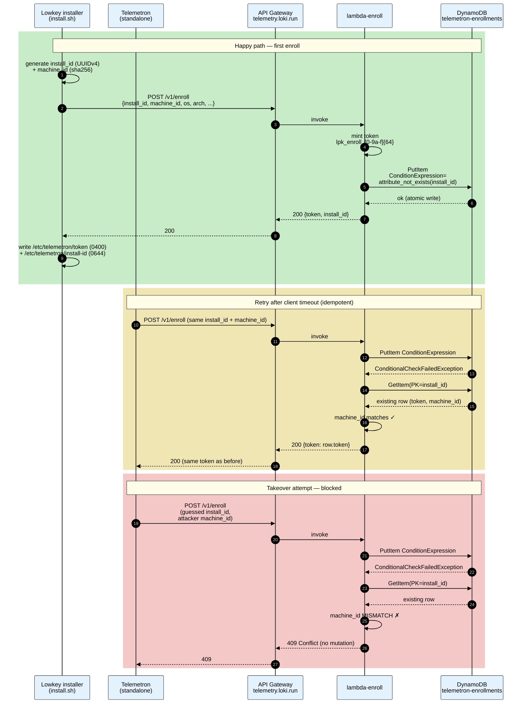
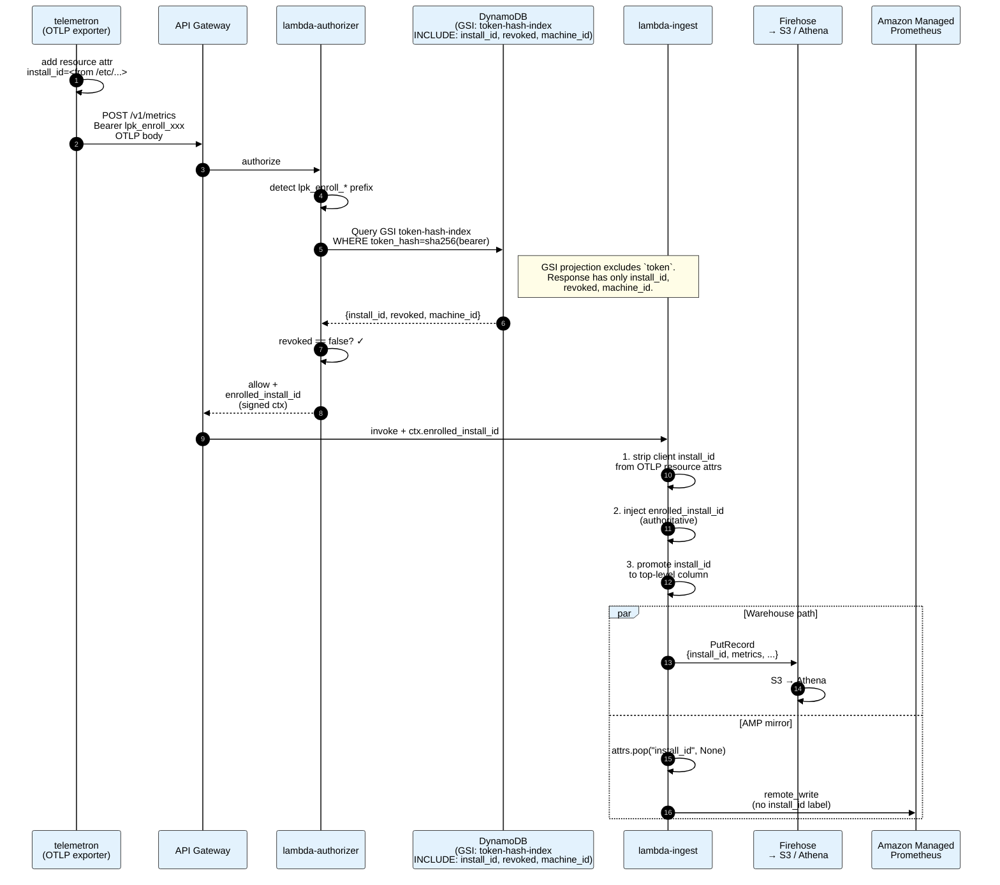
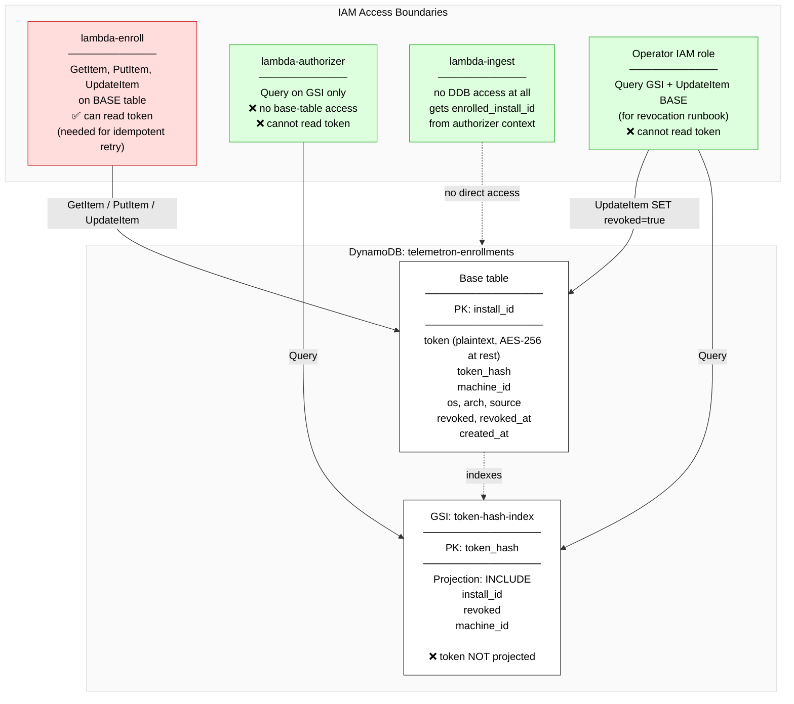

# telemetron v0.3.0 — Enrollment Architecture

Final design (plan v6, Codex-accepted). Commit: `d2c438c` on branch `v0.3.0-enrollment-plan`.

---

## 1. Enrollment flow (happy path + retry + takeover attempt)

---

## 2. Metrics flush & authorization (steady state)

---

## 3. DynamoDB key design & IAM boundaries

---

## 4. Repository / component map

```mermaid
%%{init: {'theme':'base','themeVariables':{'primaryColor':'#f5f5f5','primaryTextColor':'#000','primaryBorderColor':'#333','lineColor':'#333','secondaryColor':'#e8e8e8','tertiaryColor':'#fafafa','noteTextColor':'#000','noteBkgColor':'#fffde7','noteBorderColor':'#333','actorTextColor':'#000','actorBkg':'#e3f2fd','actorBorder':'#333','signalColor':'#000','signalTextColor':'#000','labelTextColor':'#000','loopTextColor':'#000'}}}%%
graph LR
    classDef default fill:#fff,stroke:#333,color:#000,stroke-width:1px
    subgraph L["inceptionstack/lowkey"]
        INSTALLSH["install.sh<br/>(existing + 1 new enroll call)"]
    end

    subgraph T["inceptionstack/telemetron"]
        TSETUP["cmd/telemetron/setup.go<br/>(existing)"]
        TENROLL["internal/enroll/<br/>(new)"]
        TEXPORT["internal/otlp/exporter.go<br/>(+1 resource attr)"]
        TSHARED["internal/machineid/<br/>(shared algorithm spec +<br/>frozen test vectors)"]
    end

    subgraph D["inceptionstack/loki-dashboard/infra/loki-telemetry"]
        INSTALL_LAMBDA["lambda-install<br/>(existing, unchanged)"]
        INGEST_LAMBDA["lambda-ingest<br/>(existing + binding logic)"]
        ENROLL_LAMBDA["lambda-enroll<br/>(NEW)"]
        AUTHZ_LAMBDA["lambda-authorizer<br/>(+ lpk_enroll_* path)"]
    end

    subgraph AWS["AWS"]
        APIGW["API Gateway<br/>telemetry.loki.run"]
        DDB_T["DynamoDB<br/>telemetron-enrollments"]
        WAF["WAF rate limits"]
        FH["Firehose → S3"]
        ATHENA["Athena<br/>(dashboard joins)"]
    end

    INSTALLSH -->|existing /v1/install| APIGW
    INSTALLSH -->|NEW /v1/enroll| APIGW
    INSTALLSH -.writes.-> TSETUP

    TSETUP --> TENROLL
    TENROLL -->|/v1/enroll<br/>&#40;standalone&#41;| APIGW
    TEXPORT -->|/v1/metrics<br/>w/ install_id| APIGW
    TSHARED -.algorithm.-> TENROLL
    TSHARED -.same alg.-> INSTALLSH

    APIGW --> WAF
    APIGW --> AUTHZ_LAMBDA
    APIGW --> ENROLL_LAMBDA
    APIGW --> INGEST_LAMBDA
    APIGW --> INSTALL_LAMBDA

    ENROLL_LAMBDA --> DDB_T
    AUTHZ_LAMBDA --> DDB_T
    INGEST_LAMBDA --> FH
    FH --> ATHENA

    classDef new fill:#cfc,stroke:#3a3,stroke-width:2px,color:#000
    classDef modified fill:#ffc,stroke:#aa3,stroke-width:2px,color:#000
    classDef existing fill:#eee,stroke:#888,color:#000
    class ENROLL_LAMBDA,TENROLL,TSHARED,DDB_T new
    class INSTALLSH,TEXPORT,AUTHZ_LAMBDA,INGEST_LAMBDA,TSETUP modified
    class INSTALL_LAMBDA,APIGW,WAF,FH,ATHENA existing
```

Legend:
- 🟢 green = new in v0.3.0
- 🟡 yellow = modified in v0.3.0
- ⚪ grey = existing, unchanged

---

## 5. Data correlation (dashboard)

```mermaid
%%{init: {'theme':'base','themeVariables':{'primaryColor':'#f5f5f5','primaryTextColor':'#000','primaryBorderColor':'#333','lineColor':'#333','secondaryColor':'#e8e8e8','tertiaryColor':'#fafafa','noteTextColor':'#000','noteBkgColor':'#fffde7','noteBorderColor':'#333','actorTextColor':'#000','actorBkg':'#e3f2fd','actorBorder':'#333','signalColor':'#000','signalTextColor':'#000','labelTextColor':'#000','loopTextColor':'#000'}}}%%
graph LR
    classDef default fill:#fff,stroke:#333,color:#000,stroke-width:1px
    subgraph Sources["Telemetry sources"]
        LOWKEY["lowkey install.sh<br/>beacon"]
        TX["telemetron<br/>(continuous flushes)"]
    end

    subgraph Tables["Data lake tables"]
        INSTALL["lowkey_install_v1<br/>install_id · pack · profile ·<br/>outcome · machine_id · ..."]
        METRICS["telemetron_metrics<br/>install_id (top-level col) ·<br/>metric_name · value · ingest_time"]
    end

    subgraph Join["Dashboard join"]
        Q["SELECT i.pack, t.metric_name, t.value<br/>FROM lowkey_install_v1 i<br/>JOIN telemetron_metrics t<br/>  ON i.install_id = t.install_id<br/>WHERE i.outcome='completed'"]
    end

    LOWKEY -->|POST /v1/install| INSTALL
    TX -->|POST /v1/metrics<br/>&#40;install_id rebound server-side&#41;| METRICS
    INSTALL --> Q
    METRICS --> Q

    classDef key fill:#fec,stroke:#c80,stroke-width:2px,color:#000
    class Q key
```

---

## Full v0.3.0 review history

| Version | Blocker Codex caught | Fix |
|---|---|---|
| v1 | Rebuilt infra that already exists in lowkey | Reuse telemetry.loki.run platform |
| v2 | Overwrite on machine_id mismatch = takeover primitive | 409 Conflict, no mutation |
| v3 | Query+PutItem not atomic under concurrency | `ConditionExpression=attribute_not_exists(install_id)` |
| v4 | Retry unimplementable (can't reverse a hash) | Store plaintext `token` in base row |
| v5 | GSI `projection:ALL` leaked token to authorizer | `projection: INCLUDE` (token excluded) + IAM boundary table |
| **v6** | **No findings** | **ACCEPT** |

Scope: 11 tasks, ~17 hours, ~2 days.
